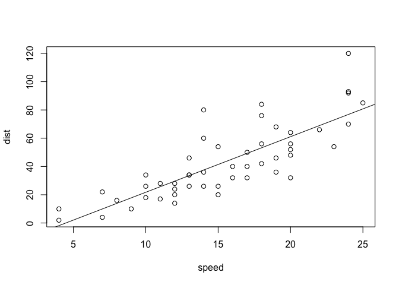

RMarkdownTest
================
RPDearden
06/11/2018

This is a paragraph in an R Markdown document.

Below is a code chunk:

``` r
fit = lm(dist ~ speed, data = cars)
b   = coef(fit)
plot(cars)
abline(fit)
```



The slope of the regression is 3.9324088.
